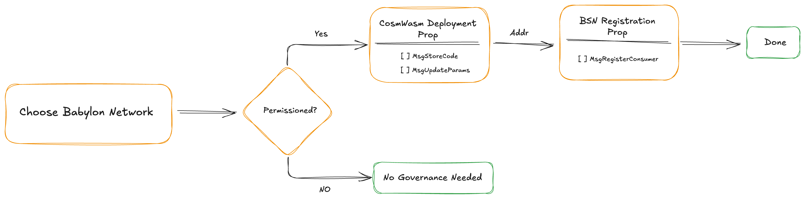

# Rollup BSN Finality Contract Management

## Introduction

The Rollup BSN contract is a CosmWasm smart contract deployed on
the Babylon Genesis chain that tracks finality signatures for rollup blocks.
It verifies signatures, timestamps public randomness, detects equivocation, and
reports misbehavior for slashing. This is the core and only
contract that a rollup deploys to become a BSN.

## BSN Lifecycle


The following steps outline the full lifecycle of a Rollup BSN contract, from 
deployment to ongoing operation and management:

1. **Contract Code Upload**: Upload the compiled WASM bytecode to Babylon 
Genesis to obtain a code ID
2. **Contract Instantiation**: Create a contract instance using the code ID 
with your specific BSN configuration 
3. **BSN Registration**: Register your BSN with Babylon using the contract 
address. Once registered you become a valid BSN and finality providers can 
start joining and providing security for your BSN
4. **Contract Maintainance**: Manage the contract, query its state, and allow 
finality providers to submit signatures and randomness

## Governance Notes



Depending on the Babylon Genesis network (e.g., testnet, mainnet) you
choose for the deployment of the rollup BSN, the network might be permissioned:
* **Permissioned CosmWasm**: Requires governance approval for deploying a smart
  contract. This can be granted in two ways:
  * `MsgStoreCode` proposal: Upload a contract code. Preferred for one-time 
deployments
  * `MsgAddCodeUploadParamsAddresses` proposal: Add a Babylon Genesis address 
in an allow-list
    for which its members can permissionlessly upload code. This is typically
    used for contracts requiring periodic maintenance.
    
  > To learn more about permissioned CosmWasm,
  > see the [deployment guide](https://docs.babylonlabs.io/guides/governance/submit_proposals/smart_contract_deployment/) 
  > and review past proposals in the [Babylon Foundation forum](https://forum.babylon.foundation/c/gov-proposals/smart-contract-proposals/15).

* **Permissioned BSN Registration**: Requires a governance approval for
  the registration of a BSN. This can be granted via the submission of
  a governance proposal executing a `MsgRegisterConsumer` using the
  metadata defined in the [Rollup BSN Registration](#rollup-bsn-registration)
  section.

<!-- TODO: once we write the governance guidlines for BSN link it here -->

> **Note**: If a network uses both Permissioned CosmWasm and 
> Permissioned BSN Registration, two separate governance proposals 
are currently required. A unified
> governance flow requiring only a single governance proposal is being
> examined.

For the rest of the document, we will assume a Permissionless CosmWasm and BSN
Registration network for simplicity. Listings that would require governance
will be highlighted appropriately.


## Instantiation


To instantiate the Rollup BSN contract, use the following command:
```shell
# Note: Use "$VAR" for strings, $VAR for numbers

INSTANT_MSG=$(cat <<EOF
{
  "admin": "$ADMIN_ADDRESS",
  "bsn_id": "$BSN_ID",
  "bsn_activation_height": $BSN_ACTIVATION_HEIGHT,
  "finality_signature_interval": $FINALITY_SIGNATURE_INTERVAL,
  "max_msgs_per_interval": $MAX_MSGS_PER_INTERVAL,
  "min_pub_rand": $MIN_PUB_RAND,
  "rate_limiting_interval": $RATE_LIMITING_INTERVAL,
  "allowed_finality_providers": ["$FP_PUBKEY_1", "$FP_PUBKEY_2"]
}
EOF
)

babylond tx wasm instantiate $CODE_ID '$INSTANT_MSG'
```
> **Note**: $CODE_ID refers to the uploaded contract code identifier on Babylon 
Genesis

### Configuration Structure

The contract accepts the following parameters during instantiation:

```rust
pub struct InstantiateMsg {
    /// The Babylon Genesis address of the contract administrator
    pub admin: String,
    /// Unique identifier for the BSN this contract secures  
    pub bsn_id: String,
    /// Minimum public randomness values included per public randomness commit
    pub min_pub_rand: u64,
    /// Rate limiting window length in Babylon blocks
    pub rate_limiting_interval: u64,
    /// Maximum messages per finality provider per interval
    pub max_msgs_per_interval: u32,
    /// Rollup block height at which finality tracking begins; 
    /// signatures for blocks before this height are rejected
    pub bsn_activation_height: u64,
    /// Interval (in rollup blocks) at which finality signatures 
    /// can be submitted  after activation
    pub finality_signature_interval: u64,
    /// Optional initial finality provider allowlist;
    /// only finality providers in allowlist can submit to contract
    pub allowed_finality_providers: Option<Vec<String>>,
}
```

### Parameter Selection Guidelines

**Admin**  

> **Type**: String  
> **Required**: Yes  
> **Mutable**: Yes (via `update_admin` message)

The `admin` is a Bech32 Babylon Genesis address that has control over the 
contract. This address is authorized to perform privileged actions such as 
modifying the allowlist, pruning data, or executing other administrative 
operations. It is critical to secure this key and assign it to a trusted 
entity. 

> **Note**: admin can also be the governance
> but this might lead to slow modifications and reaction times.

**BSN Identifier**  

> **Type**: String (unique)
> **Required**: Yes  
> **Mutable**: No  

The `bsn_id` must be unique across all BSNs on Babylon Genesis. The identifier 
can only contain alphanumeric characters, hyphens, and underscores with a 
maximum length of 100 characters. This must match the BSN ID used during BSN 
registration

**Activation Height**  

> **Type**: Integer (positive)  
> **Required**: Yes  
> **Mutable**: No  

The `bsn_activation_height` determines when finality tracking begins. Use 0 for 
immediate activation upon contract deployment. For delayed activation, specify 
the rollup block height after which finality signatures will be accepted.

**Finality Signature Interval**  

> **Type**: Integer (positive)  
> **Required**: Yes  
> **Mutable**: No 

The `finality_signature_interval` controls how frequently (in rollup blocks) 
finality providers submit signatures. Signatures are only accepted every N 
blocks after activation, where `(height - bsn_activation_height) % 
finality_signature_interval == 0`. Higher intervals reduce computational 
overhead but provide less frequent finality confirmations. The interval should 
not be more frequent than the Babylon Genesis block time.

**Rate Limiting Interval**  

> **Type**: Integer (postiive)  
> **Required**: Yes  
> **Mutable**: No

The `rate_limiting_interval` specifies the length (in Babylon Genesis blocks) 
of the rate limiting window. Within each interval, a finality provider can 
submit a limited number of messages, including both public randomness 
commitments and finality signature submissions. Once the interval resets, the 
provider's submission count is cleared. This mechanism helps prevent spam or 
accidental flooding by controlling how often a provider can interact with the 
contract.

**Max Messages Per Interval**  

> **Type**: Integer (positive)  
> **Required**: Yes  
> **Mutable**: No

The `max_msgs_per_interval` sets the maximum number of messages a finality 
provider can submit during each rate limiting interval. If a provider reaches 
this limit, any further messages in the current interval will be rejected. This 
parameter, together with `rate_limiting_interval`, enforces the submission rate 
for all message types.

<!-- TODO: Add concrete parameter recommendations after load testing -->

**Public Randomness**  

> **Type**: Integer (positive)  
> **Required**: Yes  
> **Mutable**: No 

The `min_pub_rand` parameter sets the minimum number of public randomness 
values that finality providers must include in each public randomness 
commitment. This parameter helps ensure sufficient entropy is provided during 
each commit

**Allowlist**  

> **Type**: Array[String] (Hex-encoded compressed BTC public keys)  
> **Required**: No (default [])  
> **Mutable**: Yes (via `add_to_allowlist` and `remove_from_allowlist` 
messages) 

The `allowed_finality_providers` is a list of BTC public keys that are 
authorized to submit finality signatures and public randomness to the contract. 
Each entry in the list must be a hex-encoded compressed BTC public key. 
Messages from unauthorized keys will be rejected by the contract. This 
parameter defines the initial allowlist at deployment time. It can be modified 
after instantiation by the contract admin.

## Rollup BSN Registration


After deploying and instantiating the Rollup BSN contract, the
rollup must register on Babylon Genesis. Registration as a BSN requires 
submitting metadata to identify and describe the BSN

To register the BSN, use:
```shell
babylond tx btcstkconsumer register-consumer \
  "$CONSUMER_ID" \
  "$CONSUMER_NAME" \
  "$CONSUMER_DESCRIPTION" \
  "$ROLLUP_FINALITY_CONTRACT_ADDRESS"
```

Required metadata for BSN registration:
* `consumer_id`: BSN ID of your rollup (same as the BSN ID you used on contract
  instantiation)
* `consumer_name`: Human-readable name of your rollup BSN (e.g., `"DeFi Rollup 
Chain"`)
* `consumer_description`: Brief description of the rollup BSN's purpose
* `rollup_finality_contract_address`: Babylon Genesis address of the deployed 
Rollup BSN contract (`bbn1...` format)

> **Governance Note**: The above operation can only be executed by governance
> in permissioned registration networks.

## Contract Maintenance


The Rollup BSN contract exposes `admin-only` functions for ongoing management. 
These allow you to clean up
old data, update roles, and adjust configuration without redeploying the 
contract.

Each operation is executed with:

```shell
babylond tx wasm execute <CONTRACT_ADDRESS> '<JSON_MSG>' 
```
**Note**: `<CONTRACT_ADDRESS>` refers to the address of the deployed Rollup BSN 
contract on Babylon. `<JSON_MSG>` is the execute 
message in JSON format, described in the sections below

### Modifying the Contract Administrator

```shell
JSON_MSG={
  "update_admin": {
    "admin": "$NEW_ADMIN_ADDRESS"
  }
}
```
> **Variables:**  
> `$NEW_ADMIN_ADDRESS`: The new admin's Bech32 Babylon Genesis address (string, e.g., `bbn1...`)

Transfers contract admin rights to a new Babylon Genesis address. Typically used when 
rotating keys or migrating ownership to another entity.

### Data Pruning

```shell
MSG={
  "prune_data": {
    "rollup_height": $BLOCK_HEIGHT,
    "max_signatures_to_prune": $MAX_SIGS,
    "max_pub_rand_values_to_prune": $MAX_PUB_RAND
  }
}
```
> **Variables:**  
> `$BLOCK_HEIGHT`: Rollup block height threshold for pruning (integer)  
> `$MAX_SIGS`: Maximum number of signatures to prune in this operation (integer)  
> `$MAX_PUB_RAND`: Maximum number of public randomness values to prune in this operation (integer)

Removes all finality signatures and public randomness for rollup blocks with 
height less than or equal to the specified value. Useful for reducing on-chain storage as the chain 
grows. Optional fields control pruning batch size to avoid gas exhaustion.

See [PRUNING.m](./PRUNING.md) for detailed guidelines on selecting safe pruning 
heights and best practices.

### Modifying the Finality Providers Allow-List

```shell
# Add FP to allowlist
MSG={
  "add_to_allowlist": {
    "fp_pubkey_hex_list": [
      "$FP_BTC_PUBKEY"
    ]
  }
}

# Remove FP from allowlist
MSG={
  "remove_from_allowlist": {
    "fp_pubkey_hex_list": [
      "$FP_BTC_PUBKEY"
    ]
  }
}
```
> **Variables:**  
> `$FP_BTC_PUBKEY`: Hex-encoded compressed BTC public key of the Finality Provider (string)

Each message accepts a `fp_pubkey_hex_list` field containing one or more BTC 
public keys. 
The contract will iterate over the list and add or remove each key accordingly.

Use these messages to onboard new Finality Providers, rotate keys, or revoke 
access from inactive 
or misbehaving ones. All changes are on-chain and transparent.

## Querying Contract Data

The Rollup BSN contract exposes queries to obtain information about finality 
signatures 
submitted by Finality Providers and their public randomness commitments. 
Queries are 
executed using the following command format:
```shell
babylond query wasm contract-state smart <CONTRACT_ADDRESS> '<QUERY_MSG>' \
  --node $NODE_RPC \
  --output json
```
Note: `CONTRACT_ADDRESS` refers to the address of the deployed Rollup BSN 
contract on Babylon. `QUERY_MSG` 
is the execute message in JSON format, described in the sections below

### Querying Finality Votes

To identify Finality Providers who submitted signatures for a specific rollup 
block, 
query by block height and hash:
```shell
QUERY_MSG={
  "block_voters": {
    "height": $BLOCK_HEIGHT,
    "hash_hex": "$BLOCK_HASH_HEX"
  }
}
```
> **Variables:**  
> `$BLOCK_HEIGHT`: Rollup block height to query (integer)  
> `$BLOCK_HASH_HEX`: Hex-encoded block hash (string)  

### Querying Public Randomness

The contract provides multiple ways to fetch public randomness commitments from 
Finality Providers. 
To return the **first commitment** posted by a provider:
```shell
QUERY_MSG={
  "first_pub_rand_commit": {
    "btc_pk_hex": "$FP_BTC_PUBKEY"
  }
}
```
> **Variables:**  
> `$FP_BTC_PUBKEY`: Hex-encoded compressed BTC public key of the Finality Provider (string)  

To return the **most recent commitment**:
```shell
QUERY_MSG={
  "last_pub_rand_commit": {
    "btc_pk_hex": "$FP_BTC_PUBKEY"
  }
}
```
> **Variables:**  
> `$FP_BTC_PUBKEY`: Hex-encoded compressed BTC public key of the Finality Provider (string)  

To page through a provider’s **full history of commitments**:
```shell
QUERY_MSG={
  "list_pub_rand_commit": {
    "btc_pk_hex": "$FP_BTC_PUBKEY",
    "start_after": $START_HEIGHT, 
    "limit": $LIMIT,              
    "reverse": $REVERSE_ORDER     
  }
}
```
> **Variables:**  
> `$FP_BTC_PUBKEY`: Hex-encoded compressed BTC public key of the Finality Provider (string)  
> `$START_HEIGHT`: (Optional) Only return commitments after this rollup block height (integer)  
> `$LIMIT`: (Optional) Maximum number of commitments to return (integer, default: 10, max: 30)  
> `$REVERSE_ORDER`: (Optional) Return results in reverse order (boolean, default: false)  

### Querying Admin and Configuration

The contract also exposes queries for inspecting the current configuration and 
state
To return the **current admin address**:
```shell
QUERY_MSG={
  "admin": {}
}
```
To return the **contract configuration**, including the BSN ID, rate limits, 
and other parameters:
```shell
QUERY_MSG={
  "config": {}
}
```
To return the list of **allowlisted Finality Providers** (BTC public keys in 
hex format):
```shell
QUERY_MSG={
  "allowed_finality_providers": {}
}
```