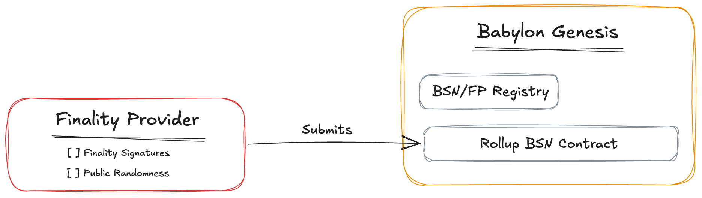

# Rollup BSN Contract Interaction

## Table of Contents

1. [Introduction](#introduction)
2. [Committing Public Randomness](#1-committing-public-randomness)
3. [Submitting Finality Signatures](#2-submitting-finality-signatures)

## Introduction



The Rollup BSN contract is a CosmWasm smart contract deployed on the Babylon
Genesis chain that tracks finality signatures for rollup blocks. Interaction with
the contract is performed by submitting messages to commit public randomness and
to submit finality signatures for rollup blocks. All interactions require the
submitter's BTC public key to be added to the contract's `allow-list`.

Each operation is executed with:

```shell
babylond tx wasm execute <CONTRACT_ADDRESS> '$JSON_MSG'
```
**Note**: `<CONTRACT_ADDRESS>` refers to the address of the deployed Rollup BSN
contract on Babylon. `$JSON_MSG` is the execute message in JSON format,
described below.

## 1. Handling Public Randomness Commitments

To commit a batch of public randomness values, submit a Merkle root to the
contract. This prevents adaptive randomness generation based on block contents.

**Message Format:**
```shell
JSON_MSG={
  "commit_public_randomness": {
    "commitment": "$MERKLE_ROOT",
    "fp_pubkey_hex": "$FP_BTC_PUBKEY",
    "num_pub_rand": $COUNT,
    "signature": "$SIGNATURE",
    "start_height": $START_BLOCK
  }
}
```

> **Variables:**  
> `$MERKLE_ROOT`: Hex-encoded Merkle root of the randomness batch (string)  
> `$FP_BTC_PUBKEY`: Hex-encoded compressed BTC public key of the submitter
> (string)  
> `$COUNT`: Number of randomness values committed (integer)  
> `$SIGNATURE`: Signature over the commitment (string)  
> `$START_BLOCK`: Rollup block height for the first randomness value (integer)

## 2. Submitting Finality Signatures

To submit a finality signature for a rollup block, send a message that proves
the use of previously committed randomness via a Merkle proof.

**Message Format:**
```shell
JSON_MSG={
  "submit_finality_signature": {
    "block_hash": "$BLOCK_HASH",
    "fp_pubkey_hex": "$FP_BTC_PUBKEY",
    "height": $BLOCK_HEIGHT,
    "proof": "$MERKLE_PROOF",
    "pub_rand": "$PUBLIC_RANDOMNESS",
    "signature": "$SIGNATURE",
    "l1_block_hash_hex": "$L1_HASH",
    "l1_block_number": $L1_NUMBER
  }
}
```

> **Variables:**  
> `$BLOCK_HASH`: Hex-encoded rollup block hash (string)  
> `$FP_BTC_PUBKEY`: Hex-encoded compressed BTC public key of the submitter
> (string)  
> `$BLOCK_HEIGHT`: Rollup block height (integer)  
> `$MERKLE_PROOF`: Merkle proof that `pub_rand` is in the committed Merkle root
> (string)  
> `$PUBLIC_RANDOMNESS`: Revealed randomness value (string)  
> `$SIGNATURE`: Signature over the message (string)  
> `$L1_HASH`: (Optional) L1 block hash (string)  
> `$L1_NUMBER`: (Optional) L1 block number (integer)