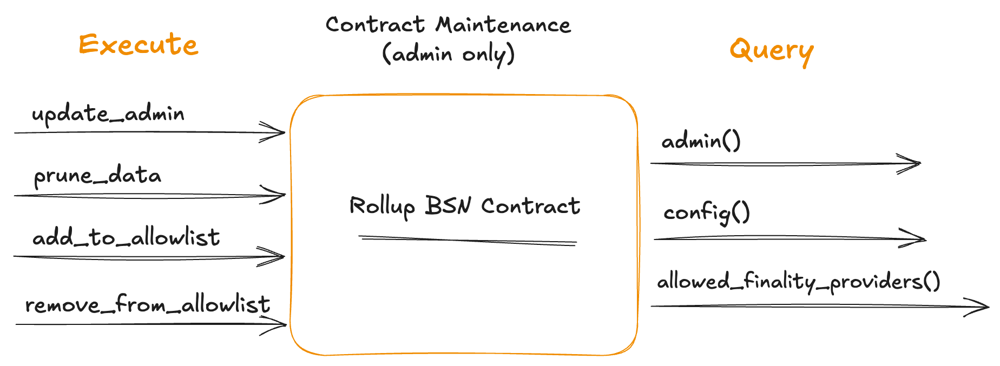

# Deployment of the Rollup BSN Contract

## Introduction

The Rollup BSN contract is a CosmWasm smart contract deployed on
the Babylon Genesis chain that tracks finality signatures for rollup blocks.
It verifies signatures, timestamps public randomness, detects equivocation, and
reports misbehavior for slashing. This is the core and only
contract that a rollup deploys to become a BSN. The contract must be deployed
on Babylon Genesis as it relies on direct interaction with it.

## Governance Notes


Depending on the Babylon Genesis network (e.g., testnet, mainnet) you
choose for the deployment of the rollup BSN, the network might be permissioned:
* **Permissioned CosmWasm**: Requires governane approval for deploying a smart
  contract. This can be granted in two ways:
  * `MsgStoreCode` proposal: Upload a contract code. Preferred for one-time deployments
  * `MsgUpdateParams` proposal: Add a Babylon Genesis address in an allow-list
    for which its members can permissionlessly upload code. This is typically
    used for contracts requiring periodic maintenance.
  > To learn more about permissioned CosmWasm,
  > see the [deployment
  > guide](https://docs.babylonlabs.io/guides/governance/submit_proposals/smart_contract_deployment/) 
  > and review past proposals in the [Babylon Foundation
  > forum](https://forum.babylon.foundation/c/gov-proposals/smart-contract-proposals/15).
* **Permissioned BSN Registration**: Requires a governance approval for
  the registration of a BSN. This can be granted via the submission of
  a governance proposal executing a `MsgRegisterConsumer` using the
  metadata defined in the [Rollup BSN Registration](#rollup-bsn-registration)
  section.

<!-- TODO: once we write the governance guidlines for BSN link it here -->

> **Note**: If a network uses both Permissioned CosmWasm and 
> Permissioned BSN Registration, two separate governance proposals 
are currently required. A unified
> governance flow requiring only a single governance proposal is being
> examined.

For the rest of the document, we will assume a Permissionless CosmWasm and BSN
Registration network for simplicity. Listings that would require governance
will be highlighted appropriately.

## Instantiation


The Rollup BSN contract is instantiated as follows:
```shell
INSTANT_MSG=$(cat <<EOF
{
  "admin": "$ADMIN_ADDRESS",
  "bsn_id": "$BSN_ID",
  "max_msgs_per_interval": $MAX_MSGS_PER_INTERVAL,
  "min_pub_rand": $MIN_PUB_RAND,
  "rate_limiting_interval": $RATE_LIMITING_INTERVAL,
  "allowed_finality_providers": ["$FP_PUBKEY_1", "$FP_PUBKEY_2"]
}
EOF
)

babylond tx wasm instantiate $CODE_ID '$INSTANT_MSG'
```

The parameters:
* `admin`: The Babylon Genesis address of the contract administrator
* `bsn_id`: The unique identifier for the BSN rollup
  Ensure that this is unique and not already used by another BSN on Babylon
  Genesis as this will affect your registration
* `min_pub_rand`: Minimum public randomness values included per public
  randomness commit by finality providers
* `rate_limiting_interval`: Length (in blocks) of the interval for
  rate-limiting submissions
* `max_msgs_per_interval`: Maximum number of submissions allowed per finality
  provider within each interval
* `allowed_finality_providers`: List of finality providers from which the contract will
  accept finality signatures and randomness

<!-- TODO: once we have docs for the allow list and rate limiting, we can link
those here -->

## Rollup BSN Registration


After deploying and instantiating the Rollup BSN contract, the
rollup must register on Babylon Genesis. Registration requires 
submitting metadata to identify and describe the BSN

To register the BSN, use:
```shell
babylond tx btcstkconsumer register-consumer \
                                <consumer_id> \
                                <consumer_name> \
                                <consumer_ description> \
                                <max_multi_staked_fps> \
                                <rollup_finality_contract_address>
```

Required metadata for BSN registration:
* `consumer_id`: BSN ID of your rollup (same as the BSN ID you used on contract
  instantiation)
* `consumer_name`: Human-readable name of your rollup BSN (e.g., `"DeFi Rollup Chain"`)
* `consumer_description`: Brief description of the rollup BSN's purpose
* `max_multi_staked_fps`: Maximum number of rollup FPs per BTC delegation. Prevents delegators from splitting
 their BTC across too many networks (recommended: `3-5`)
* `rollup_finality_contract_address`: Babylon Genesis address of the deployed Rollup BSN contract (`bbn1...` format)

> **Governance Note**: The above operation can only be executed by governance
> in permissioned registration networks.

## Contract Maintenance


The Rollup BSN contract exposes `admin-only` functions for ongoing management. These allow you to clean up
old data, update roles, and adjust configuration without redeploying the contract.

Each operation is executed with:

```shell
babylond tx wasm execute <CONTRACT_ADDRESS> '<MSG>' 
```
**Note**: <CONTRACT_ADDRESS> refers to the address of the deployed Rollup BSN contract on Babylon. <MSG> is the execute message in JSON format, described in the sections below

### Modifying the Contract Administrator
```shell
MSG={
  "update_admin": {
    "admin": $NEW_ADMIN_ADDRESS
  }
}
```
Transfers contract admin rights to a new Babylon address. Typically used when rotating keys or migrating
ownership to another entity.

### Data Pruning
```shell
MSG={
  "prune_data": {
    "rollup_height": $BLOCK_HEIGHT,
    "max_signatures_to_prune": $MAX_SIGS,
    "max_pub_rand_values_to_prune": $MAX_PUB_RAND
  }
}
```
Removes all finality signatures and public randomness for rollup blocks with height less than or
equal to the specified value. Useful for reducing on-chain storage as the chain grows. Optional
fields control pruning batch size to avoid gas exhaustion.

See [PRUNING.m](./PRUNING.md) for detailed guidelines on selecting safe pruning heights and best
practices.

### Modifying the Finality Providers Allow-List
```shell
# Add FP to allowlist
MSG={
  "add_to_allowlist": {
    "fp_pubkey_hex_list": [
      $FP_PUBKEY
    ]
  }
}

# Remove FP from allowlist
MSG={
  "remove_from_allowlist": {
    "fp_pubkey_hex_list": [
      $FP_PUBKEY
    ]
  }
}
```
Adds or removes Finality Providers from the allowlist. Use this to onboard new providers or revoke
access from inactive or misbehaving ones.